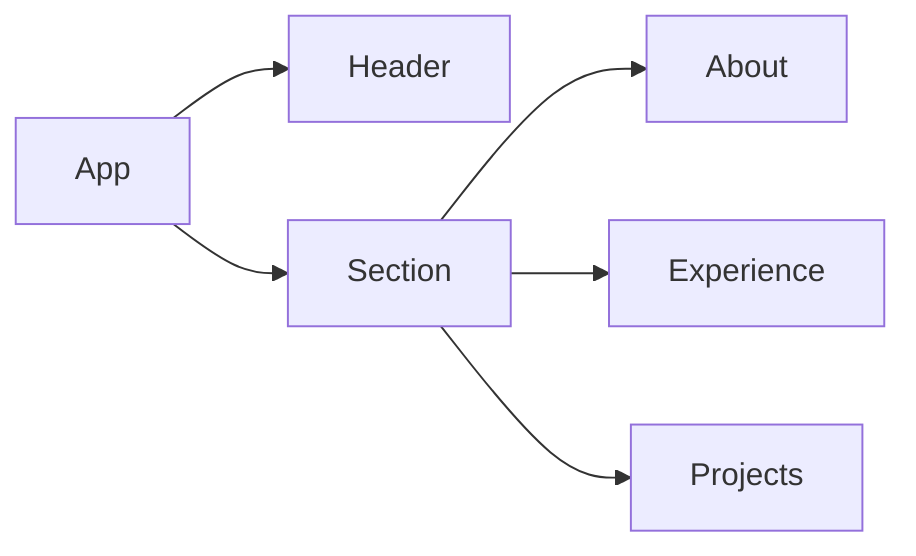
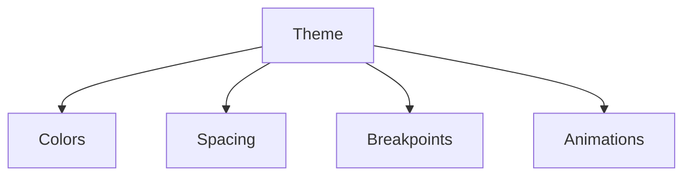
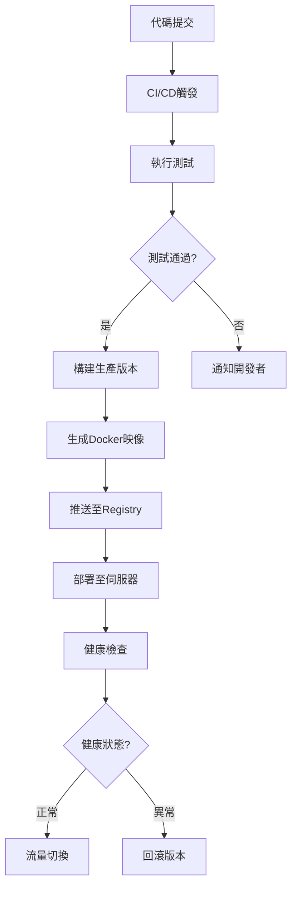

# 技術文檔

## 項目架構
```
my-resume-website/
├── src/
│   ├── components/     # 可重用組件
│   │   ├── Header.tsx  # 頂部導航
│   │   ├── Section.tsx # 區塊容器
│   │   └── ...
│   ├── theme.ts        # 主題配置
│   └── App.tsx         # 組件聚合入口
├── public/             # 靜態資源
└── docs/               # 技術文檔
```

## 組件文檔

### 組件交互關係


### Header 組件

```typescript
interface HeaderProps {
  sections: { id: string; title: string }[];
  onSectionClick: (id: string) => void;
}
```

- **功能**: 頁面頂部導航欄，提供各區塊的快速訪問
- **特點**:
  - 響應式設計，自動適應移動端
  - 滾動時自動高亮當前區塊
  - 平滑滾動效果

### Section 組件

```typescript
interface SectionProps {
  id: string;
  title: string;
  children: React.ReactNode;
  backgroundColor?: string;
}
```

- **功能**: 統一的區塊容器組件
- **特點**:
  - 自定義背景顏色和漸變
  - 統一的標題樣式
  - 響應式佈局

### About 組件

```typescript
interface AboutProps {
  id: string;
}
```

- **功能**: 個人資訊展示
- **數據結構**:
  ```typescript
  interface Profile {
    name: string;
    title: string;
    avatar: string;
    bio: string;
    email: string;
    phone: string;
    tags: string[];
  }
  ```

## 主題配置

### 樣式系統架構


主題配置位於 `src/theme.ts`，包含：
```typescript
export default {
  colors: {
    primary: '#1890ff',
    secondary: '#722ed1',
    success: '#52c41a'
  },
  spacing: {
    unit: 8,
    sectionPadding: '80px 24px'
  },
  breakpoints: {
    xs: '480px',
    sm: '576px',
    md: '768px'
  },
  animations: {
    fadeIn: 'fadeIn 0.5s ease forwards'
  }
};
```
- 顏色系統：定義品牌主色與功能色
- 排版設置：包含字級與間距規範
- 響應式斷點：移動優先的斷點設置
- 動畫配置：全局動畫參數

## 狀態管理

目前使用 React 的內置狀態管理：
- useState: 組件級狀態
- useRef: DOM引用和持久化值
- useEffect: 副作用處理

## 樣式系統

### Emotion 使用指南

```typescript
// 示例：創建樣式化組件
const StyledButton = styled.button`
  background: ${props => props.theme.colors.primary};
  padding: 8px 16px;
  border-radius: 4px;
`;
```

### 響應式設計

使用 Ant Design 的 Grid 系統：
```typescript
<Row gutter={[16, 16]}>
  <Col xs={24} sm={12} md={8} lg={6}>
    // 內容
  </Col>
</Row>
```

## 性能優化

### 代碼分割
- 使用 React.lazy 進行組件懶加載
- 使用 Suspense 處理加載狀態

### 圖片優化
- 使用適當的圖片格式和大小
- 實現懶加載

## 開發工具配置

### ESLint 配置
位於 `eslint.config.js`：
- TypeScript 規則
- React Hooks 規則
- 代碼格式規則

### TypeScript 配置
位於 `tsconfig.json`：
- 嚴格模式啟用
- 模塊解析設置
- 編譯選項

### Vite 配置
位於 `vite.config.ts`：
- 開發服務器設置
- 構建優化
- 插件配置

## 測試指南

### 單元測試
使用 Jest 和 React Testing Library：
```typescript
describe('Component Test', () => {
  it('should render correctly', () => {
    render(<Component />);
    expect(screen.getByText('測試文本')).toBeInTheDocument();
  });
});
```

## 部署流程

### 完整部署流程圖


### Docker部署
```bash
# 開發模式
docker-compose -f docker-compose.yml -f docker-compose.dev.yml up

# 生產模式
docker build -t my-resume .
docker run -p 80:80 my-resume
```

### 靜態部署
```bash
npm run build && npm run preview
```

## 故障排除

### 常見問題

1. 開發服務器啟動失敗
   - 檢查端口佔用
   - 確認依賴安裝完整

2. 構建錯誤
   - 檢查TypeScript類型錯誤
   - 確認環境變量配置

### 調試技巧

- 使用 React Developer Tools
- 使用 Chrome DevTools
- 檢查控制台錯誤信息

## 版本控制

### Git 工作流

1. 功能開發
   ```bash
   git checkout -b feature/new-feature
   ```

2. 提交規範
   ```bash
   feat: 添加新功能
   fix: 修復錯誤
   docs: 更新文檔
   style: 代碼格式調整
   refactor: 代碼重構
   ```

## 安全考慮

- 避免在前端存儲敏感信息
- 實施適當的錯誤處理
- 使用HTTPS進行部署
- 定期更新依賴包

