# 🖥️ 前端技術與 UI 架構說明

這份說明針對個人履歷網站的前端技術進行整理，涵蓋使用的框架、UI 套件、設計模式與元件模組化方式，以及系統架構與數據流程。

---

## 📦 前端技術堆疊

| 類別 | 技術 | 說明 |
|------|------|------|
| 前端框架 | **React** | 建立整體網站的單頁應用（SPA） |
| 型別系統 | **TypeScript** | 靜態型別檢查，提高開發穩定性與可讀性 |
| 構建工具 | **Vite** | 快速構建與熱更新，提升開發效率 |
| 路由系統 | **React Router** | 處理頁面導航與 URL 參數解析 |

---

## 🎨 UI 套件與樣式系統

| 類別 | 套件 / 技術 | 說明 |
|------|---------------|---------|
| UI 元件庫 | **Ant Design** | 使用其 Grid 系統（Row、Col）進行響應式設計 |
| 樣式設計 | **Emotion** | CSS-in-JS 工具，支援主題變數與模組化樣式 |
| 富文字編輯器 | **ReactQuill** | 用於部落格文章撰寫的 WYSIWYG 編輯器 |

### 📌 Ant Design 使用範例
```tsx
<Row gutter={[16, 16]}>
  <Col xs={24} sm={12} md={8} lg={6}>
    {/* 內容區塊 */}
  </Col>
</Row>
```

### 📌 Emotion 使用範例
```tsx
const StyledButton = styled.button`
  background: ${props => props.theme.colors.primary};
  padding: 8px 16px;
  border-radius: 4px;
`;
```

---

## 🧱 元件化架構與設計模式

網站各區塊皆採用高度模組化的方式，具備可重用與樣式隔離特性。

| 元件 | 功能說明 |
|------|-------------|
| `Header` | 導覽列，含導向與動畫效果 |
| `Section` | 包裝每個內容區塊，支援背景顏色、標題、間距與 RWD |
| `About` | 個人簡介與技能區塊 |
| `Blog` | 部落格文章列表展示 |
| `BlogPost` | 單篇文章內容顯示，支援密碼保護與富文字解析 |
| `ExperienceTimeline` | 展示經歷的時間軸 UI |
| `ProjectCard` | 專案展示卡片，結合動畫與技術 tag 呈現 |

---

## 📱 響應式設計

- 使用 **Ant Design Grid 系統** 實現跨裝置的內容排版
- 配合 Emotion 自訂媒體查詢（Media Query）支援斷點定義
- 所有組件皆支援手機與桌機排版切換

---

## 💡 補充特色

- **主題統一設計**：透過 Emotion 主題系統集中管理顏色、字型與 spacing
- **模組化檔案結構**：每個組件獨立目錄，維護方便
- **擴充性高**：可快速新增區塊或樣式而不影響其他元件
- **部落格功能**：整合 ReactQuill 富文本編輯器，支援文章的創建、編輯與刪除
- **社交媒體整合**：在 Contact 與 Footer 組件中整合 GitHub、Instagram 等社交媒體連結
- **表單整合**：支援將聯絡表單提交到 Google 表單，實現無後端的資料收集

---

## 🗄️ 數據存儲與管理

### 部落格數據存儲機制

本專案採用 LocalStorage 作為輕量級數據存儲解決方案，實現了無後端的部落格功能：

```typescript
// 單例模式實現的數據管理器
class DatabaseManager {
  private static instance: DatabaseManager;
  private readonly STORAGE_KEY = 'blog_posts';

  // 獲取實例的靜態方法
  public static getInstance(): DatabaseManager {
    if (!DatabaseManager.instance) {
      DatabaseManager.instance = new DatabaseManager();
    }
    return DatabaseManager.instance;
  }

  // 數據操作方法
  public async getAllPosts(): Promise<BlogPost[]>
  public async addPost(post: Omit<BlogPost, 'id'>): Promise<number>
  public async updatePost(post: BlogPost): Promise<void>
  public async deletePost(id: number): Promise<void>
}
```

### 部落格文章密碼保護實現

文章密碼保護功能通過以下方式實現：

1. 在文章數據結構中添加 `isProtected` 和 `password` 字段
2. 使用 `crypto-js` 進行密碼加密存儲
3. 訪問受保護文章時，顯示密碼輸入界面
4. 密碼驗證通過後，才顯示文章內容

---

## 🚀 性能優化策略

### 代碼分割與懶加載

使用 React.lazy 和 Suspense 實現組件懶加載，減少初始加載時間：

```tsx
const BlogPost = React.lazy(() => import('./components/BlogPost'));

// 在路由中使用
<Suspense fallback={<div>Loading...</div>}>
  <Route path="/blog/:id" element={<BlogPost />} />
</Suspense>
```

### 圖片優化

- 使用 WebP 格式減少圖片大小
- 實現圖片懶加載，提升頁面加載速度
- 使用 srcset 屬性提供不同尺寸的圖片，適應不同設備
- 利用 UI 元件庫（如 Ant Design 的 Image 元件）提供的圖片處理功能（如預覽、佔位符、錯誤處理）以提升用戶體驗與健壯性。

### 緩存策略

- 使用 Service Worker 實現資源緩存
- 實現 PWA (Progressive Web App) 功能，支持離線訪問
- 使用 HTTP 緩存頭優化網絡請求

---

## 🐳 Docker 容器化最佳實踐

### 多階段構建

使用多階段構建減小最終鏡像大小：

```dockerfile
# 構建階段
FROM node:18-alpine AS build
WORKDIR /app
COPY package*.json ./
RUN npm ci
COPY . .
RUN npm run build

# 生產階段
FROM nginx:alpine
COPY --from=build /app/dist /usr/share/nginx/html
COPY nginx.conf /etc/nginx/conf.d/default.conf
EXPOSE 80
CMD ["nginx", "-g", "daemon off;"]
```

### 開發與生產環境分離

使用 docker-compose 管理不同環境：

- 開發環境：熱重載、調試工具、開發依賴
- 生產環境：優化構建、最小化依賴、安全配置

---

## 📊 系統架構圖

```
┌─────────────────────────────────────────────────────┐
│                  前端應用 (React)                    │
└───────────────────────┬─────────────────────────────┘
                        ↓
┌─────────────────────────────────────────────────────┐
│                路由系統 (React Router)               │
└───────┬───────────────────────────┬─────────────────┘
        ↓                           ↓
┌───────────────┐   ┌───────────────────────────────────┐
│  靜態頁面組件  │   │            部落格系統             │
└───────┬───────┘   └───────────────────┬───────────────┘
        ↓                               ↓
┌───────────────┐   ┌───────────────────────────────────┐
│  UI 元件庫    │   │     本地存儲 (LocalStorage)       │
│ (Ant Design)  │   └───────────────────┬───────────────┘
└───────┬───────┘                       ↓
        ↓           ┌───────────────────────────────────┐
┌───────────────┐   │       數據加密與安全處理          │
│  樣式系統     │   │       (crypto-js)                 │
│  (Emotion)    │   └───────────────────────────────────┘
└───────────────┘
```

### 數據流程說明

1. **用戶請求流程**：
   - 用戶訪問網站 → React Router 解析 URL → 加載對應組件 → 渲染頁面
   - 組件初始化 → 從 LocalStorage 獲取數據 → 處理數據 → 更新 UI

2. **部落格文章操作流程**：
   - 創建文章：表單輸入 → 數據驗證 → 加密敏感信息 → 存儲到 LocalStorage
   - 讀取文章：獲取文章 ID → 從 LocalStorage 讀取 → 解密內容 → 渲染到 UI
   - 更新文章：修改表單 → 數據驗證 → 更新 LocalStorage → 刷新 UI
   - 刪除文章：確認刪除 → 從 LocalStorage 移除 → 更新文章列表

---

## 🔒 安全性考量

### 前端安全防護

| 安全威脅 | 防護措施 | 實現方式 |
|---------|---------|----------|
| XSS 攻擊 | 內容淨化 | 使用 DOMPurify 庫淨化富文本內容 |
| CSRF 攻擊 | 表單保護 | 實現一次性令牌驗證機制 |
| 敏感數據洩露 | 數據加密 | 使用 crypto-js 加密存儲敏感信息 |
| 點擊劫持 | 框架保護 | 設置適當的 X-Frame-Options 頭 |

### 代碼示例：內容淨化實現

```tsx
import DOMPurify from 'dompurify';

const sanitizeContent = (html: string): string => {
  return DOMPurify.sanitize(html, {
    ALLOWED_TAGS: ['p', 'b', 'i', 'em', 'strong', 'a', 'ul', 'ol', 'li', 'br'],
    ALLOWED_ATTR: ['href', 'target', 'rel'],
  });
};

// 在渲染富文本內容時使用
<div dangerouslySetInnerHTML={{ __html: sanitizeContent(post.content) }} />
```

### 密碼強度檢查

```typescript
const checkPasswordStrength = (password: string): PasswordStrength => {
  const hasUpperCase = /[A-Z]/.test(password);
  const hasLowerCase = /[a-z]/.test(password);
  const hasNumbers = /\d/.test(password);
  const hasSpecialChars = /[!@#$%^&*(),.?":{}|<>]/.test(password);
  
  const strength = [
    hasUpperCase,
    hasLowerCase,
    hasNumbers,
    hasSpecialChars,
    password.length >= 8
  ].filter(Boolean).length;
  
  return {
    score: strength,
    isStrong: strength >= 4,
    feedback: getPasswordFeedback(strength)
  };
};
```

---

## 📊 性能指標與監控策略

### 關鍵性能指標 (Core Web Vitals)

| 指標 | 目標值 | 監控工具 |
|------|-------|----------|
| LCP (Largest Contentful Paint) | < 2.5秒 | Lighthouse, Web Vitals JS |
| FID (First Input Delay) | < 100毫秒 | Web Vitals JS |
| CLS (Cumulative Layout Shift) | < 0.1 | Lighthouse, Web Vitals JS |
| TTI (Time to Interactive) | < 3.8秒 | Lighthouse |

### 性能監控實現

```typescript
import { getCLS, getFID, getLCP } from 'web-vitals';

function sendToAnalytics(metric) {
  // 將指標發送到分析服務
  console.log(metric);
  
  // 實際應用中，可以發送到 Google Analytics 或自定義後端
  // window.gtag('event', 'web_vitals', {
  //   event_category: 'Web Vitals',
  //   event_action: metric.name,
  //   event_value: Math.round(metric.value),
  //   event_label: metric.id,
  // });
}

// 註冊性能指標監控
getCLS(sendToAnalytics);
getFID(sendToAnalytics);
getLCP(sendToAnalytics);
```

### 用戶體驗監控

- **錯誤追蹤**：使用 ErrorBoundary 組件捕獲 React 渲染錯誤
- **用戶行為分析**：記錄頁面停留時間、點擊路徑和交互模式
- **性能瓶頸識別**：通過 React Profiler 識別渲染性能問題

---

## 🔄 CI/CD 流程說明

### 持續整合流程

```mermaid
graph TD
    A[代碼提交] --> B[GitHub Actions 觸發]
    B --> C[安裝依賴]
    C --> D[代碼檢查 ESLint]
    D --> E[類型檢查 TypeScript]
    E --> F[單元測試]
    F --> G[構建測試]
    G --> H[部署預覽環境]
```



### GitHub Actions 配置示例

```yaml
name: CI/CD Pipeline

on:
  push:
    branches: [ main, develop ]
  pull_request:
    branches: [ main ]

jobs:
  build-and-test:
    runs-on: ubuntu-latest
    
    steps:
    - uses: actions/checkout@v3
    
    - name: Setup Node.js
      uses: actions/setup-node@v3
      with:
        node-version: '18'
        cache: 'npm'
    
    - name: Install dependencies
      run: npm ci
    
    - name: Lint check
      run: npm run lint
    
    - name: Type check
      run: npm run type-check
    
    - name: Build
      run: npm run build
    
    - name: Deploy to GitHub Pages
      if: github.ref == 'refs/heads/main'
      uses: JamesIves/github-pages-deploy-action@v4.4.1
      with:
        branch: gh-pages
        folder: dist
```

### 部署策略

- **開發環境**：每次提交到 develop 分支自動部署到開發預覽環境
- **測試環境**：合併到 staging 分支後部署到測試環境進行 QA
- **生產環境**：合併到 main 分支並通過所有檢查後部署到生產環境

---

## 🔮 未來擴展計劃

### 技術升級路線圖

| 階段 | 計劃 | 預期效益 |
|------|------|----------|
| 第一階段 | 遷移到 Next.js 框架 | 改善 SEO、提供 SSR 支持 |
| 第二階段 | 引入 GraphQL API | 優化數據獲取、減少過度獲取 |
| 第三階段 | 實現真實後端存儲 | 擴展數據持久化能力、支持更複雜功能 |

### 功能擴展計劃

- **多語言支持**：使用 i18next 實現中英文切換
- **主題定制**：允許用戶選擇深色/淺色模式
- **互動式項目展示**：添加 3D 模型和動畫效果
- **評論系統**：整合第三方評論服務如 Disqus

### 性能優化計劃

- **採用 Intersection Observer API** 優化懶加載實現
- **引入 Workbox** 增強 Service Worker 功能
- **實現流式 SSR** 提高大型頁面的加載體驗
- **使用 Module Federation** 實現微前端架構